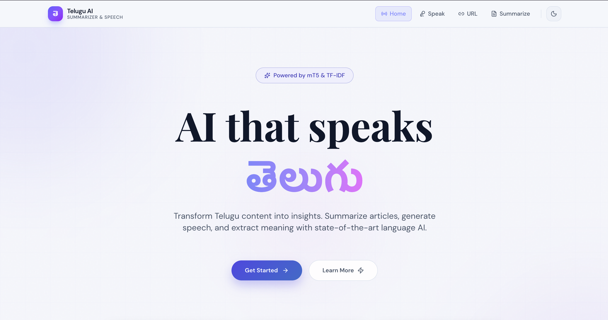
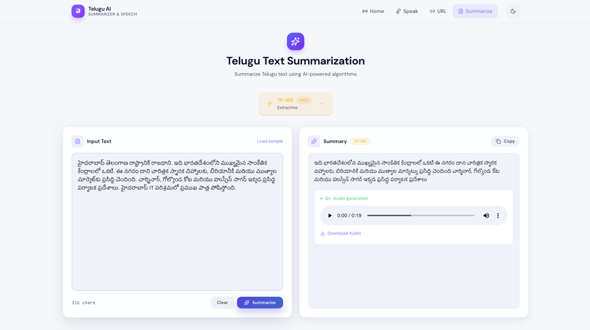
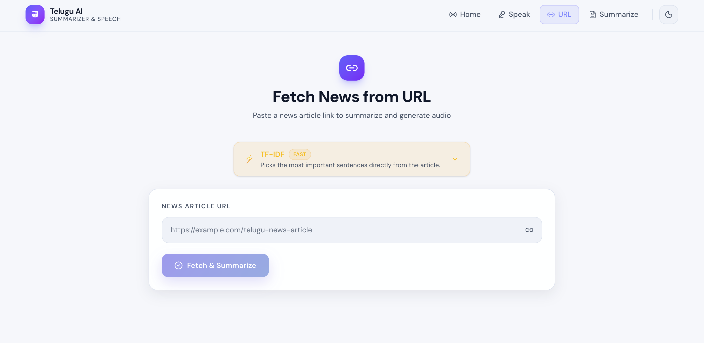
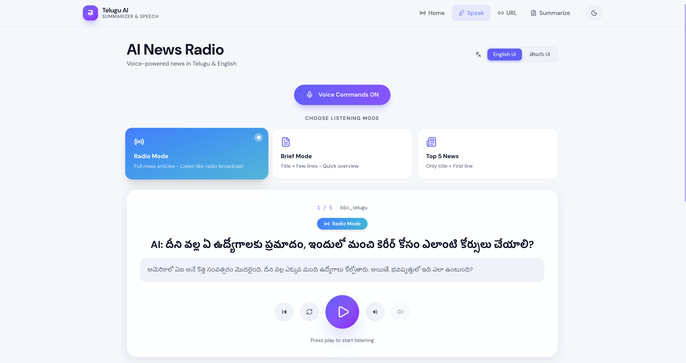
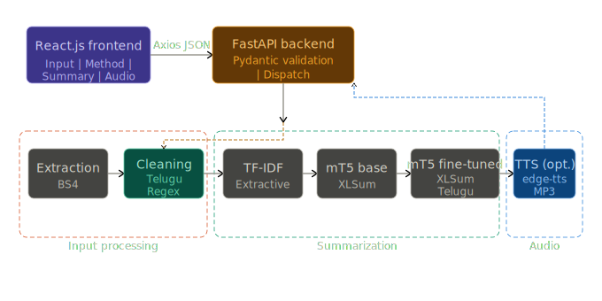

# 📰 Automated Telugu Text Summarization & Speech Generation (NLP)

🚧 **Status:** Research paper under review (ICANITS 2026)

**AI-powered Telugu NLP system for text summarization and speech generation using TF-IDF and mT5.**

Full-stack AI web application for **Telugu news understanding**, combining extractive and abstractive NLP with optional speech synthesis.

This system enables users to input Telugu text or news URLs and receive concise summaries along with optional Telugu audio playback.

---

# 🎬 Demo

🎥 **Video Demo:**
[Watch Demo](https://drive.google.com/file/d/1BcKZtN3p1y47VnsjAZhXa5IvfEEtf2h3/view?usp=sharing)

🧪 **What the demo shows:**

* Telugu text summarization using mT5
* URL-based article summarization
* Model selection (TF-IDF / mT5)
* Output generation via FastAPI

🔊 **Note:**
Text-to-Speech (TTS) audio output is supported. Audio playback may not be audible in the demo due to screen recording limitations.

**Sample:**

* **Input:** Telugu news article
* **Output:** Concise summary with optional MP3 audio

---

# 🚀 Project Highlights

* ✅ End-to-end working NLP system
* ✅ Extractive + Transformer-based summarization (TF-IDF + mT5)
* ✅ Runtime model selection via API
* ✅ Telugu Text-to-Speech generation
* ✅ Full-stack integration (React + FastAPI)
* ✅ Research-backed architecture with evaluation

---

# 📸 Application Screenshots

## 🏠 Home Page



## 📝 Text Summarization



## 🌐 URL Summarization



## 🔊 Speak News Module



---

# 🏗️ System Architecture



The system follows a modular pipeline:
Input → FastAPI backend → NLP processing (TF-IDF / mT5) → Optional TTS output

---

# 🧠 NLP Pipeline Components

| File               | Purpose                           |
| ------------------ | --------------------------------- |
| extract.py         | URL parsing & article extraction  |
| clean.py           | Telugu text normalization         |
| summarize_tfidf.py | Extractive summarization (TF-IDF) |
| summarize_mt5.py   | Transformer-based summarization   |
| tts.py             | Speech generation (Edge TTS)      |
| pipeline.py        | End-to-end orchestration          |

---

# 📊 Evaluation Results

| Model          | ROUGE-1 | ROUGE-2 | ROUGE-L | BERTScore |
| -------------- | ------- | ------- | ------- | --------- |
| TF-IDF         | 0.0324  | 0.0034  | 0.0320  | 0.6728    |
| mT5 Base       | 0.0436  | 0.0022  | 0.0427  | 0.7239    |
| mT5 Fine-Tuned | 0.0404  | 0.0019  | 0.0400  | 0.7229    |

📌 **Key Insight:**
Fine-tuning did not improve performance due to limited dataset size and the pre-trained model already covering the same distribution.

---

# 🧠 Key Learnings

* Pre-trained multilingual models can outperform fine-tuned models with limited data
* BERTScore is more reliable than ROUGE for morphologically rich languages like Telugu
* Fine-tuning large models (580M parameters) requires significantly more data
* Extractive methods may show misleading ROUGE scores due to lexical overlap

---

# 📂 Project Structure

```
.
├── backend/
├── frontend/
├── screenshots/
├── assets/
├── requirements.txt
├── LICENSE
└── README.md
```

---

# ⚙️ Installation Guide

## Backend Setup

```bash
python -m venv myenv
source myenv/bin/activate     # macOS/Linux
# myenv\Scripts\activate      # Windows

pip install -r requirements.txt
cd backend
cp .env.example .env   # optional: adjust CORS_ORIGINS / port
uvicorn app:app --reload
```

Backend: http://localhost:8000

---

## Frontend Setup

```bash
cd frontend
npm install
cp .env.example .env   # optional: point VITE_API_URL at deployed backend
npm run dev
```

Frontend: http://localhost:5173

---

# 🔌 API Endpoints

```
GET /health
POST /summarize
POST /process-url
GET /latest-news
GET /audio/{filename}
```

---

# 🔊 Speech System

* Implemented using Edge TTS
* Telugu neural voice output (MP3)
* Served via backend API

---
# 📦 Fine-Tuned Model Note

The fine-tuned mT5 model is not included in this repository due to size constraints.

- If the local fine-tuned model is not found, the system automatically falls back to the public mT5 base model (`csebuetnlp/mT5_multilingual_XLSum`).
- This ensures the application runs successfully after cloning the repository.

To use the fine-tuned model:

1. Place the model in:
   `backend/model/mt5-telugu-news-finetuned/`

2. Restart the backend server

📌 If not provided, the base model will be used by default.

---

# 👥 Team Contributions

* **Hariharan (Backend & NLP Engineering)**

  * Designed FastAPI backend and API architecture
  * Built NLP pipeline (extraction → cleaning → summarization)
  * Integrated mT5 models and handled evaluation (ROUGE, BERTScore)

* **Vishnu (Frontend Development)**

  * Developed React UI components
  * Integrated frontend with backend APIs
  * Implemented user interaction for summarization features

* **Vivek (Testing & Integration)**

  * Performed system testing and validation
  * Ensured smooth integration between frontend and backend
  * Debugged API responses and handled edge cases

* **Sanjeev (Data Processing)**

  * Handled dataset preparation and preprocessing
  * Cleaned and normalized Telugu text data
  * Assisted in model experimentation and evaluation

---

# 🔮 Future Enhancements

* Larger Telugu datasets for improved fine-tuning
* Parameter-efficient tuning (LoRA)
* Long-context summarization
* Multilingual expansion (Tamil, Kannada, Malayalam)

---

# 📄 Research Context

This project demonstrates:

* Low-resource Indian language NLP
* Transformer-based summarization (mT5)
* Full-stack AI system design
* Real-world deployment pipeline

---

⭐ If you find this project useful, feel free to explore, contribute, or share feedback.
